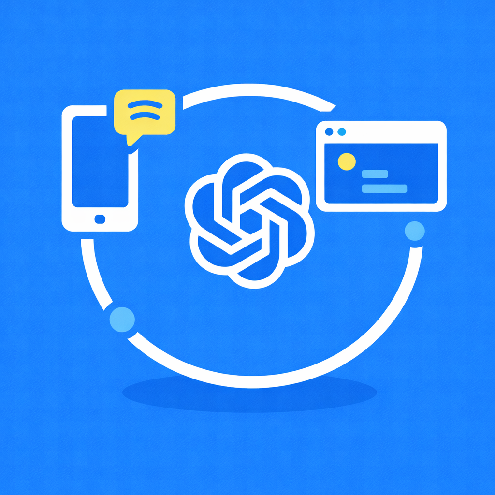

<p align="center">
  
</p>

<h1 align="center">Codex Remote Hub</h1>

<p align="center">
  <strong>Access Codex CLI from anywhere.</strong><br>
  Use your full OpenAI Codex CLI — from your phone, tablet, or any browser — securely through Tailscale.
</p>

<p align="center">
  
  
  
  
  
  
  
</p>

---

## Why Codex Remote Hub?

OpenAI Codex CLI runs on your computer. It has access to your files, your git repos, your environment, your SSH keys — everything you need for real development work. But what if you're away from your desk?

**Codex Remote Hub lets you use Codex CLI from any device**, without compromising on capabilities:

- **Full power** — It's your real Codex CLI, not a web wrapper or limited API. Every tool, every permission, every feature.
- **Your machine** — All files, all repos, all environment variables. Nothing is uploaded to the cloud.
- **Secure by default** — Runs over [Tailscale](https://tailscale.com), a mesh VPN. No ports exposed to the internet. No accounts to create. Only your devices can connect.
- **Persistent sessions** — Close your browser, put your phone away. When you come back, everything is exactly where you left it.
- **Capture running sessions** — Already have Codex CLI running in a terminal? Capture it and continue from your phone with full conversation history.
- **Zero dependencies** — Pure Python stdlib. No frameworks, no build step, no node_modules.

Whether you're reviewing a PR on the couch, fixing a bug from a coffee shop, or pair-programming from your phone on the train — Codex Remote Hub gives you the full CLI experience, anywhere.

## Architecture

```
┌──────────────┐                              ┌───────────────────────────────┐
│    Phone /   │                              │    Your Computer              │
│    Tablet /  │ ◄── Tailscale (mesh VPN) ──► │                               │
│    Browser   │     encrypted tunnel         │  :7690  Codex Remote Hub (web) │
└──────────────┘                              │  :77xx  ttyd → tmux           │
                                              │              └─ codex         │
                                              └───────────────────────────────┘
```

Codex Remote Hub is a lightweight HTTP server that manages terminal sessions:

1. You open the dashboard from any device on your Tailscale network
2. Create a session — it starts `tmux` + `codex` in the background
3. `ttyd` serves the terminal as a web page
4. You get a full Codex CLI terminal in your browser, with a virtual keyboard for mobile

**Stack**: Python 3 (stdlib only) · [ttyd](https://github.com/tsl0922/ttyd) · [tmux](https://github.com/tmux/tmux) · [Tailscale](https://tailscale.com)

## Quick Start

```bash
# 1. Clone
git clone https://github.com/orseni/codex-remote-hub.git
cd codex-remote-hub

# 2. Install (auto-detects your OS)
bash install.sh

# 3. Open on your phone
# https://your-machine.tailnet.ts.net:7690
```

## Prerequisites

| Dependency | Required | Install |
|---|---|---|
| **Codex CLI** | Yes | `npm install -g @openai/codex` |
| **Tailscale** | Yes (for remote access) | [tailscale.com/download](https://tailscale.com/download) — install on both your computer and phone |
| **Python 3.9+** | Yes | Usually pre-installed |
| **tmux** | Yes | Installed automatically by `install.sh` |
| **ttyd** | Yes | Installed automatically by `install.sh` |

## Installation

### macOS

```bash
git clone https://github.com/orseni/codex-remote-hub.git
cd codex-remote-hub
bash install.sh
```

The installer uses Homebrew to install `tmux` and `ttyd`, creates a LaunchAgent for autostart, and sets up the `codex-remote-hub` command.

### Linux (Ubuntu/Debian, Fedora, Arch)

```bash
git clone https://github.com/orseni/codex-remote-hub.git
cd codex-remote-hub
bash install.sh
```

The installer auto-detects your package manager (`apt`, `dnf`, `pacman`), installs dependencies, and creates a systemd user service.

### Windows (WSL2)

1. Install [WSL2](https://learn.microsoft.com/en-us/windows/wsl/install) with Ubuntu
2. Install [Tailscale inside WSL](https://tailscale.com/download/linux)
3. Inside WSL:

```bash
git clone https://github.com/orseni/codex-remote-hub.git
cd codex-remote-hub
bash install.sh
```

> **Note:** On WSL, Codex Remote Hub runs as a foreground process (no daemon). Add it to your `~/.bashrc` for auto-start, or run manually.

### Uninstall

```bash
codex-remote-hub uninstall
# or
bash install.sh --uninstall
```

## HTTPS Setup

HTTPS is **recommended** for mobile access and **required** for iOS Safari.

### Why HTTPS?

- **iOS Safari** silently blocks WebSocket connections (`ws://`) in cross-origin iframes. HTTPS with WSS resolves this completely.
- **Android Chrome** works without HTTPS but benefits from the encrypted connection.
- **Security** — even though Tailscale already encrypts traffic, HTTPS adds defense-in-depth and enables modern browser APIs (clipboard, notifications).

### How to set up

**Automatic (recommended):** The installer (`install.sh`) automatically requests Tailscale certificates during setup. Just make sure HTTPS is enabled in your Tailscale admin console (DNS → Enable HTTPS) before running the installer.

**Manual setup:** If you skipped HTTPS during install or need to regenerate certificates:

```bash
# 1. Enable HTTPS in Tailscale admin console:
#    DNS → Enable HTTPS

# 2. Generate certificates and install them
sudo tailscale cert \
  --cert-file ~/.codex-remote-hub/hub.crt \
  --key-file ~/.codex-remote-hub/hub.key \
  your-machine.tailnet.ts.net

# 3. Restart
codex-remote-hub restart
```

Codex Remote Hub auto-detects the certificates and enables HTTPS + TLS 1.2+ with modern cipher suites.

## Usage

### On your phone

1. Open `https://your-machine.tailnet.ts.net:7690` in your browser
2. Type a session name and tap **Create**
3. Choose the project directory
4. The Codex CLI terminal opens directly in your browser
5. Use the virtual keyboard for special keys (Esc, Ctrl+C, arrows, Tab, etc.)

### Add to Home Screen

Turn Codex Remote Hub into a full-screen app:

- **iOS**: Share → Add to Home Screen
- **Android**: Menu (⋮) → Add to Home Screen

### CLI Commands

```bash
codex-remote-hub start       # Start the server
codex-remote-hub stop        # Stop the server
codex-remote-hub restart     # Restart
codex-remote-hub status      # Show status and active sessions
codex-remote-hub logs        # Tail log files
codex-remote-hub uninstall   # Remove everything
```

## Configuration

All settings are optional environment variables:

| Variable | Default | Description |
|---|---|---|
| `CODEX_REMOTE_HUB_PORT` | `7690` | Dashboard port |
| `CODEX_FONT_SIZE` | `11` | Terminal font size |
| `CODEX_DEV_ROOT` | `~/Projects` | Root directory for the folder picker |
| `CODEX_REMOTE_HUB_DIR` | `~/.codex-remote-hub` | Installation directory |
| `TTYD_BIN` | auto-detected | Path to ttyd binary |
| `TMUX_BIN` | auto-detected | Path to tmux binary |
| `CODEX_BIN` | auto-detected | Path to Codex CLI binary |

Set these in your shell profile (`~/.bashrc`, `~/.zshrc`) or in the service configuration.

## API Reference

| Method | Route | Description |
|---|---|---|
| GET | `/` | Dashboard |
| GET | `/start/{name}` | Create/resume a session |
| GET | `/terminal/{name}` | Terminal wrapper page |
| GET | `/stop/{name}` | Stop a session |
| GET | `/api/sessions` | List sessions (JSON) |
| GET | `/api/ttyd-ready/{name}` | Check if ttyd is ready |
| GET | `/api/folders?path=` | Browse directories |
| GET | `/api/capturable` | List capturable CLI sessions (JSON) |
| GET | `/capture` | Capture a running CLI session |
| GET | `/cert` | Download SSL certificate |
| GET | `/icon.png` | App icon |
| POST | `/api/send-keys/{name}` | Send special key to terminal |
| POST | `/api/send-text/{name}` | Send text (paste) to terminal |
| POST | `/api/scroll/{name}` | Scroll terminal (PgUp/PgDn) |

## Project Structure

```
codex-remote-hub/
├── codex-remote-hub.py              # HTTP server (~1000 lines, stdlib only)
├── templates/
│   ├── hub.html               # Dashboard (mobile-first, dark theme)
│   └── terminal.html          # Terminal wrapper + virtual keyboard
├── install.sh                 # Cross-platform installer
├── icon_cxhub.png             # App icon
├── LICENSE                    # MIT
├── CONTRIBUTING.md            # Contribution guidelines
├── CHANGELOG.md               # Version history
├── ROADMAP.md                 # Community TODO list
└── CODEX.md                   # Codex CLI instructions
```

**Production** (created by `install.sh`):

```
~/.codex-remote-hub/
├── codex-remote-hub.py              # Server
├── templates/                 # HTML templates
├── ttyd-index.html            # Custom ttyd interface (optional)
├── hub.crt / hub.key          # HTTPS certificates (optional)
├── ctl.sh                     # Control script
├── hub.log                    # Stdout log
└── hub-error.log              # Stderr log
```

## Security

Codex Remote Hub's security model relies on **Tailscale network isolation**:

- **No ports exposed to the internet** — only devices on your Tailscale network can connect
- **HTTPS** with Let's Encrypt certificates via Tailscale (TLS 1.2+, ECDHE+AESGCM/CHACHA20)
- **No additional authentication needed** — Tailscale already authenticates every device
- **Sessions run as your user** — same permissions as if you were at your computer
- **Input validation** — special key whitelist, path traversal prevention, paste size limits

See [SECURITY.md](SECURITY.md) for the full security policy and vulnerability reporting.

## Troubleshooting

<details>
<summary><strong>Server won't start</strong></summary>

```bash
codex-remote-hub logs
cat ~/.codex-remote-hub/hub-error.log
```

Check that all dependencies are installed: `tmux`, `ttyd`, `codex`, `python3`.
</details>

<details>
<summary><strong>Port already in use</strong></summary>

```bash
lsof -i :7690       # or: ss -tlnp sport = :7690
kill -9 <PID>
codex-remote-hub restart
```
</details>

<details>
<summary><strong>Gray/blank terminal on iOS Safari</strong></summary>

This happens when HTTPS is not configured. iOS Safari silently blocks WebSocket connections over plain HTTP in cross-origin contexts.

**Solution:** Set up HTTPS following the [HTTPS Setup](#https-setup) section above.
</details>

<details>
<summary><strong>Terminal works on desktop but not on mobile</strong></summary>

1. Make sure Tailscale is active on your phone
2. Check that you can ping your computer from the Tailscale app
3. Use HTTPS (especially required for iOS Safari)
4. Try opening the ttyd URL directly: `https://your-machine.tailnet.ts.net:77XX`
</details>

<details>
<summary><strong>Orphaned sessions</strong></summary>

```bash
tmux list-sessions           # See all tmux sessions
tmux kill-session -t name    # Kill a specific session
pkill -f "ttyd.*-p 77"      # Kill orphaned ttyd processes
```
</details>

<details>
<summary><strong>ttyd not found on Linux</strong></summary>

ttyd may not be available in your distro's package manager. Options:

```bash
# Via snap
sudo snap install ttyd --classic

# Or build from source
# See: https://github.com/tsl0922/ttyd#installation
```
</details>

## Roadmap

See [ROADMAP.md](ROADMAP.md) for the full list of planned features and community contribution opportunities.

Highlights:
- Authentication layer (optional password/token)
- Docker container support
- Session sharing (read-only spectator mode)
- Automated test suite
- i18n framework

## Contributing

Contributions are welcome! See [CONTRIBUTING.md](CONTRIBUTING.md) for guidelines.

## License

[MIT](LICENSE) — Codex Remote Hub Contributors
